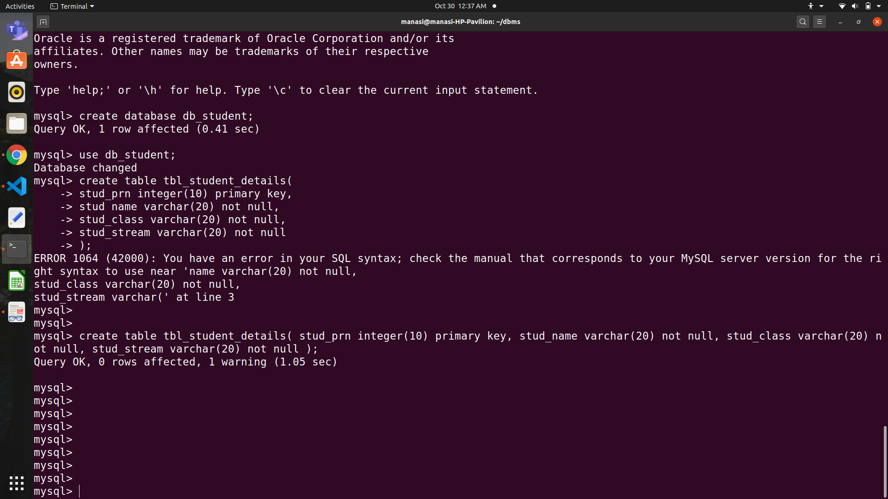
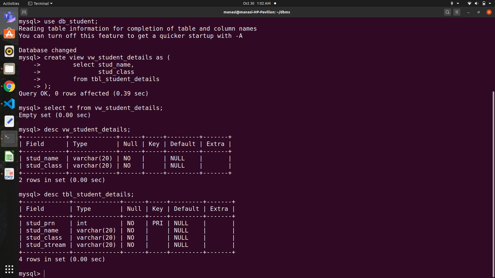
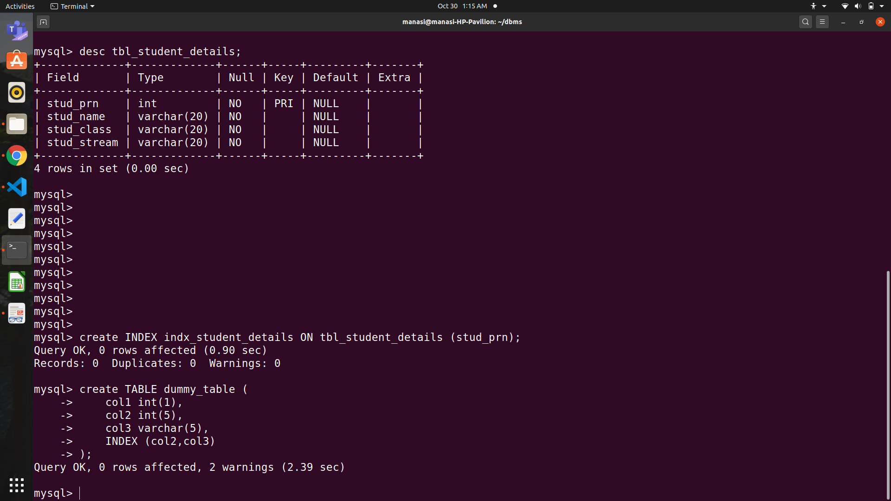
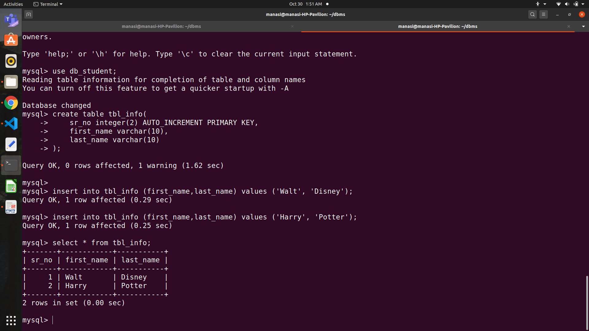

| Assignment 2: | Design and Develop SQL DDL statements which demonstrate the use of SQL objects such as Table, View, Index, Sequence, Synonym|
|--|--|

|Command |Use  |
|--|--|
|**CREATE**|To CREATE an object. Eg: Creating database, tables, triggers, index, functions, stored procedures, etc..|
|**ALTER**|To ALTER the existing database or table or its object structures.|
|**DROP**|To DROP the table by removing all its data and table structure.|
|**TRUNCATE**|Used to remove entire data from table, but the table structure remains as it is! There is still existence of table structure.|

#### [View Queries](https://github.com/WaderManasi/TE-DBMSLab-Assignments/blob/master/A-02%20SQL-DDL%20Commands/QUERIES.SQL)

|  |  |
|--|--|
|[Table](https://github.com/WaderManasi/DBMS_Lab_Assignments/blob/master/A-02%20SQL:%20DDL%20Commands/queries.sql)||
|[View](https://github.com/WaderManasi/DBMS_Lab_Assignments/blob/master/A-02%20SQL:%20DDL%20Commands/queries.sql)||
|[Index](https://github.com/WaderManasi/DBMS_Lab_Assignments/blob/master/A-02%20SQL:%20DDL%20Commands/queries.sql)||
|[Sequence](https://github.com/WaderManasi/DBMS_Lab_Assignments/blob/master/A-02%20SQL:%20DDL%20Commands/queries.sql)||
|[Synonym](https://github.com/WaderManasi/DBMS_Lab_Assignments/blob/master/A-02%20SQL:%20DDL%20Commands/queries.sql)||

#### SQL DDL Commands:
- SQL Data Definition Language (DDL) commands are used for structuring of the data/table.
- DDL commands are used to CREATE and MODIFY the structure of a Database and Database Objects.
- DDL commands implicitly perform COMMIT operations.
- Hence, these commands once fired cannot be ROLLBACKED!

For more info : Refer [MySQL Documentation](https://dev.mysql.com/doc/)